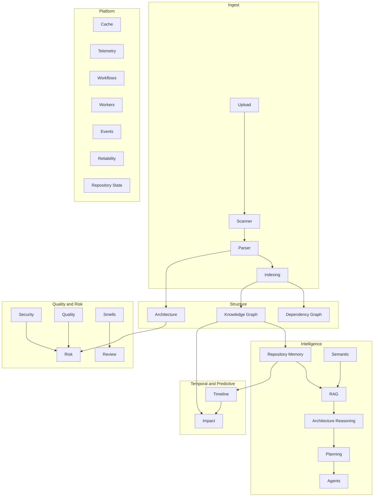

# Architecture — CodeGraph Backend

> **Source of truth for implemented systems.** Do not treat the root `README.md` folder sketch as current — the live layout is `backend/app/*`.  
> **Related:** [MODULE_INDEX.md](./MODULE_INDEX.md) · [AI_RULES.md](./AI_RULES.md) · [CODING_STANDARDS.md](./CODING_STANDARDS.md)

---

## System context

```text
┌─────────────────────────────────────────────────────────────────┐
│                        Clients / Copilot / Agents                 │
└───────────────────────────────┬─────────────────────────────────┘
                                │ HTTP (FastAPI)
┌───────────────────────────────▼─────────────────────────────────┐
│ app/api/*  (thin routers)  +  app/schemas/* (Pydantic)            │
└───────────────────────────────┬─────────────────────────────────┘
                                │
┌───────────────────────────────▼─────────────────────────────────┐
│ Domain engines (app/<capability>/*)                               │
│  Analysis │ Graphs │ Memory │ Semantic │ RAG │ Reasoning          │
│  Planning │ Agents │ Timeline │ Impact │ Integrations             │
└───────┬─────────────────┬─────────────────┬──────────────────────┘
        │                 │                 │
┌───────▼──────┐  ┌───────▼──────┐  ┌───────▼──────────────────────┐
│ Cache        │  │ Telemetry    │  │ Workflows / Workers / Jobs /   │
│ CacheInterface│  │ TelemetryMgr │  │ Events / Reliability / State │
└──────────────┘  └──────────────┘  └────────────────────────────────┘
```

**Entry point:** `backend/app/main.py`  
**Runtime:** FastAPI + Uvicorn, lifespan starts `reliability_manager` + `worker_pool`.

---

## Layered capability map



---

## Subsystems (implemented)

For each: responsibility, components, dependencies, consumers, data flow, why it exists, extensibility.

### Repository Scanner

| | |
|--|--|
| **Location** | `app/services/scanner_service.py`, API `/scan` |
| **Responsibility** | Enumerate repository files/languages for analysis |
| **Dependencies** | Filesystem / upload paths |
| **Consumers** | Parser, graphs, many analysis engines |
| **Why** | Shared inventory so engines do not re-walk trees differently |
| **Extensibility** | Additional language/file filters |

### Parser Engine

| | |
|--|--|
| **Location** | `app/parsers/` (`parser_engine.py`, AST models, language loader) |
| **Responsibility** | Parse source into structured AST/project results |
| **Consumers** | Architecture, UML, quality, knowledge graph, etc. |
| **Why** | Single parse pipeline |
| **Extensibility** | New language loaders |

### Framework Detector

| | |
|--|--|
| **Location** | `app/services/framework_detector.py`, API `/frameworks` |
| **Responsibility** | Detect frameworks/libraries |
| **Consumers** | Architecture, reports, memory summaries |

### Dependency Graph

| | |
|--|--|
| **Location** | `app/services/dependency_graph.py`, API `/dependency-graph` |
| **Responsibility** | Build import/dependency graphs |
| **Consumers** | Knowledge graph, architecture, microservices, impact (via KG structures) |
| **Rule** | Do not reimplement traversal here for new features — reuse graph query/traverser |

### Knowledge Graph

| | |
|--|--|
| **Location** | `app/knowledge_graph/` (`graph_builder`, `graph_query`, `graph_serializer`) |
| **Responsibility** | Unified nodes/edges across analysis outputs |
| **Components** | `KnowledgeGraphBuilder`, `GraphQuery` (neighbors, `find_path`), serializer |
| **Consumers** | Memory builder, semantic traverser, impact analysis, RAG graph context |
| **Why** | Single structural brain |
| **Extensibility** | New node/edge types; inject built graphs into Impact |

### Architecture Builder / Architecture API

| | |
|--|--|
| **Location** | `app/analyzers/architecture_builder.py`, API `/architecture` |
| **Responsibility** | Layer/component architecture views |
| **Consumers** | Drift, recommendations, reports, risk |

### Visualization / Diagrams / UML

| | |
|--|--|
| **Location** | `app/visualization/`, `app/uml/`, APIs `/diagrams`, `/uml` |
| **Responsibility** | Diagram generation from analysis models |

### Embedding Pipeline / Search / Semantic

| | |
|--|--|
| **Location** | `app/rag/embedding_service.py`, vector/retriever pieces, `app/semantic/`, APIs `/search`, `/semantic` |
| **Responsibility** | Embeddings, semantic/hybrid search, symbol resolve, relationship traverse |
| **Key reuse** | `RelationshipTraverser` used by Impact propagation |
| **Consumers** | RAG, Semantic Engine facade, search API |
| **Extensibility** | Swap vector store backend (see tech debt) |

### Indexing & Incremental Indexing / Repository Snapshot

| | |
|--|--|
| **Location** | `app/indexing/`, `app/incremental_indexing/` (`snapshot_manager`, change detector, invalidators, merger) |
| **Responsibility** | Index lifecycle; incremental change sets; snapshot evolve/merge |
| **Consumers** | Timeline history provider (snapshot metadata), many analyzers via `IndexManager` |
| **Rule** | Never duplicate indexing inside new CG modules |

### Repository Memory

| | |
|--|--|
| **Location** | `app/repository_memory/`, API `/repository-memory` |
| **Components** | `MemoryEngine`, builder, updater, retriever, store, statistics, serializer |
| **Responsibility** | Structured long-lived summaries (modules/files/symbols/APIs) |
| **Consumers** | RAG, Reasoning, Timeline enrichment, Impact graph seeding, DocumentationAgent |
| **Rule** | Never bypass memory when a durable summary is needed |

### Advanced RAG

| | |
|--|--|
| **Location** | `app/rag/` (`rag_engine`, query analyzer, context selector/optimizer, citations) |
| **Responsibility** | Compose LLM context from Memory + Semantic + Graph (+ Timeline when intent matches) |
| **API** | `/rag` |

### Architecture Reasoning

| | |
|--|--|
| **Location** | `app/architecture_reasoning/`, API under `/architecture` (reasoning tags) |
| **Responsibility** | Explain architecture using pipeline + memory summaries |
| **Consumers** | Planning (`architecture_explanation`), ArchitectureAgent |

### Planning Engine

| | |
|--|--|
| **Location** | `app/planning/`, API `/planning` |
| **Components** | Classifier, retrieval/reasoning strategies, execution planner, pipeline, statistics |
| **Responsibility** | Map queries → intent → modules → order → cost/confidence |
| **Consumers** | Multi-agent collaboration **must** use planning for orchestration |
| **Intents (current)** | `architecture_explanation`, `concept_explanation`, `code_modification`, `code_location`, `impact_analysis`, `timeline_analysis`, `general_query` |

### Engineering Multi-Agent Framework

| | |
|--|--|
| **Location** | `app/agents/` |
| **Components** | `BaseAgent`, registry, manager, collaboration engine, task dispatcher, builtins |
| **Builtin agents** | Architecture, Security, Documentation, Refactoring, Dependency, Timeline, Impact |
| **Rule** | Agents call engines; dispatcher runs selected agents from plan intent |

### Timeline Intelligence (CG-067)

| | |
|--|--|
| **Location** | `app/timeline/`, API `/timeline` |
| **Components** | HistoryProvider ABC, CommitAnalyzer, EvolutionTracker, HotspotDetector, OwnershipTracker, ArchitectureDrift (timeline-scoped), TimelineStatistics, TimelineEngine |
| **Responsibility** | Repository evolution, hotspots, ownership, historical summaries |
| **Dependencies** | Memory, Snapshot manager, Cache, Telemetry |
| **Consumers** | Planning (`timeline_analysis`), TimelineAgent, Impact risk hotspots, RAG timeline context |
| **Extensibility** | Git/GitHub/GitLab/Bitbucket providers (stubs today) |

### Impact Analysis (CG-068)

| | |
|--|--|
| **Location** | `app/impact_analysis/`, API `/impact` |
| **Components** | DependencyImpact, ArchitectureImpact, APIImpact, ChangePropagation, RiskAnalyzer, ImpactStatistics, ImpactEngine |
| **Responsibility** | Predict blast radius, propagation paths, change risk, confidence |
| **Dependencies** | GraphQuery + RelationshipTraverser, Memory, Timeline, Cache, Telemetry |
| **Extensibility** | `related_files` / `change_type` for future Git diff / PR analysis; injectable `graph_provider` |

### Quality / Smells / Refactoring / Security / Metrics / Review / Risk

| Domain | Package | Notes |
|--------|---------|-------|
| Quality | `app/quality/` | Analyzer + scoring; **API router exists but not registered in `main.py`** (debt) |
| Smells | `app/smells/` | Same registration gap |
| Refactoring | `app/refactoring/` | Same registration gap |
| Security | `app/security/` | Registered `/security` |
| Metrics | `app/metrics/` | Registered `/metrics` |
| Review | `app/review/` | Registered `/review` |
| Risk | `app/risk/` | Registered `/risk`; Impact does **not** reimplement this engine |

### Architecture Drift / Recommendations / Report

- `app/architecture_drift/` — snapshot architecture health/drift (`/architecture-drift`)
- `app/architecture_recommendation/` — improvement suggestions
- `app/architecture_report/` — executive reports  
Distinct from **timeline** `architecture_drift.py` (historical coupling signals).

### Design Patterns / SOLID / Microservices / Database Schema / API Flow

Specialized structural analyzers with dedicated APIs (`/design-patterns`, `/solid`, `/microservices`, `/database-schema`, `/api-flow`).

### Bug Localization / PR Review / Code Generation

- `bug_localization`, `pull_request_review`, `code_generation` — registered engines for localization, PR commentary, scaffolding.

### Workspace / Dashboard / Team Analytics / Repository Comparison / Release Notes

Multi-repo and reporting surfaces (`workspace`, `dashboard`, `team_analytics`, `repository_comparison`, `release_notes`).

### Copilot / Unified Intelligence Orchestrator (CG-070)

| | |
|--|--|
| **Location** | `app/copilot/`, API `/copilot` |
| **Responsibility** | Orchestrate existing intelligence to answer engineering questions like an AI Software Architect |
| **Components** | CopilotEngine, ConversationManager/Memory, ContextBuilder, PromptBuilder, ToolExecutor, ProviderManager, ResponseBuilder, PostProcessor, ExecutionStatistics (+ legacy IntentRouter/CapabilityRegistry) |
| **Dependencies** | Planning, Agents, Memory, RAG, Reasoning, Timeline, Impact, Reports, Cache, Telemetry |
| **APIs** | `POST /chat`, `POST /execute`, `GET|DELETE /history`, legacy `POST /{upload_id}` |
| **Rule** | Never reimplement engines — register tools / providers instead |
| **Extensibility** | `ToolExecutor.register`, `ProviderManager.register`; future specialist agents as tools |

### Chat / Explain / README / API Docs

Conversational and documentation generators (`chat`, `ai/`, `readme`, `apidocs`). Chat LLM path includes mock answer generation today. Prefer Copilot `/chat` for repository intelligence Q&A.

### Integrations: GitHub / Jira / CI/CD / Notifications

Engines + clients exist; **clients are documented as mock implementations** for demonstration.

### Jobs / Workers / Workflows / Events / Repository State / Reliability

| System | Role |
|--------|------|
| `jobs` | Async job queue/manager for analysis pipeline |
| `workers` | Worker pool started on app lifespan |
| `workflows` | Declarative `repository_processing` DAG (upload→…→ready) |
| `events` | In-process event bus / publisher / subscribers |
| `repository_state` | State machine for repository lifecycle |
| `reliability` | Retries, circuit breaker, DLQ, timeouts — initialized on startup |

### Distributed Cache

| | |
|--|--|
| **Location** | `app/cache/` — `CacheInterface`, `MemoryCache`, `CacheManager`, `CacheKeys` |
| **Why** | Backend-neutral caching; Redis migration should implement interface only |
| **Used by** | Semantic, Timeline, Impact, others |

### Telemetry

| | |
|--|--|
| **Location** | `app/telemetry/` — metrics, tracing, logging facade, health |
| **Why** | Unified observability; HTTP middleware correlation |

---

## Request data flow (typical intelligence query)

```text
POST /copilot/chat
  → CopilotEngine
  → planning_engine.plan(query)
  → ContextBuilder (Memory + RAG + conversation)
  → ToolExecutor (engines / optional agents)
  → ProviderManager.synthesize
  → PostProcessor + structured CopilotChatResponse
```

```text
POST /agents/execute/{repository_id}
  → CollaborationEngine
  → planning_engine.plan(query)
  → intent → agent list
  → TaskDispatcher → Agent.execute → domain engine
  → AgentExecutionResponse
```

```text
POST /impact/analyze/{repository_id}
  → ImpactEngine.analyze
  → Memory + Timeline (+ optional KG provider)
  → RelationshipTraverser / GraphQuery
  → dependency / architecture / API / risk / stats
  → cache + telemetry
```

---

## Registration gap (important)

These API modules exist under `app/api/` but are **not** `include_router`'d in `main.py`:

- `quality.py` (`/quality`)
- `smells.py` (`/smells`)
- `refactoring.py` (`/refactoring`)

Domain packages still exist and are reused by other engines. See [TECH_DEBT.md](./TECH_DEBT.md).

---

## Frontend

A `frontend/` tree exists (React/Tailwind tooling present). Backend AI_CONTEXT focuses on `backend/` as the intelligence platform; do not assume frontend feature parity with every backend engine.
