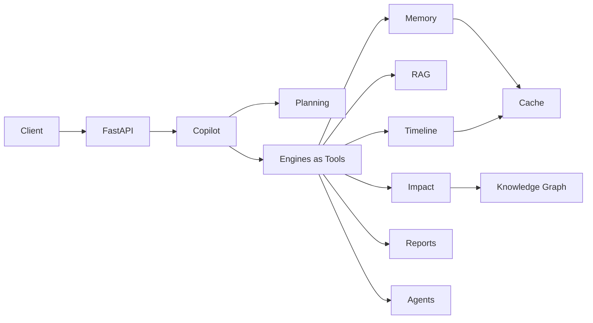

# CodeGraph

[](https://github.com/AP24110011695/CodeGraph/actions/workflows/ci.yml)
[](./CHANGELOG.md)
[](./backend/requirements.txt)
[](https://fastapi.tiangolo.com/)
[](./LICENSE)
[](./AI_CONTEXT/CURRENT_STATUS.md)

**The AI Software Architect for Every Codebase**

CodeGraph is an **enterprise AI software architecture platform**. It analyzes repositories, builds knowledge graphs, maintains long-lived repository memory, plans multi-agent work, predicts change impact, and answers engineering questions through a unified Copilot orchestrator.

> Not a toy code-search demo — a composed intelligence stack with Planning → Agents → Engines.

---

## Why CodeGraph?

| Challenge | How CodeGraph helps |
|-----------|---------------------|
| “What is the architecture?” | Architecture builder + reasoning + memory |
| “What breaks if I change X?” | Impact analysis via graph traversal reuse |
| “How did this evolve?” | Timeline intelligence (hotspots, ownership) |
| “Give me an engineering report” | Composed reports from Memory/Timeline/Impact |
| “Ask the codebase like an architect” | Copilot orchestrates Planning + tools + LLMs |

---

## Features (implemented)

- **Ingest & structure** — upload, scan, parse, index, incremental snapshots  
- **Graphs** — dependency graph + unified knowledge graph + GraphQuery  
- **Quality & risk** — quality, smells, refactoring, security, metrics, risk  
- **Memory & retrieval** — Repository Memory, Semantic Engine, Advanced RAG  
- **Reasoning & planning** — Architecture Reasoning, Planning Engine, Multi-Agent Framework  
- **Temporal & predictive** — Timeline Intelligence, Impact Analysis  
- **Reporting & Copilot** — Engineering Reports + Unified Orchestrator (`/copilot/chat`)  
- **Platform** — CacheInterface, Telemetry, Workflows, Workers, Reliability  

Portfolio-oriented summaries: [`PROJECT_ASSETS/`](./PROJECT_ASSETS/).

---

## Architecture (system overview)



Full diagrams: [`docs/architecture/OVERVIEW.md`](./docs/architecture/OVERVIEW.md) · [`AI_CONTEXT/ARCHITECTURE.md`](./AI_CONTEXT/ARCHITECTURE.md)

---

## Quick start

```bash
git clone https://github.com/AP24110011695/CodeGraph.git
cd CodeGraph/backend
python -m venv .venv
# Windows: .venv\Scripts\activate
source .venv/bin/activate
pip install -r requirements.txt
cp .env.example .env
uvicorn app.main:app --reload --host 127.0.0.1 --port 8000
```

| Resource | URL |
|----------|-----|
| Health | http://127.0.0.1:8000/health |
| OpenAPI | http://127.0.0.1:8000/docs |
| Copilot | `POST /copilot/chat` |

```bash
python -m pytest tests/ -q
```

Expected RC-1 baseline: **1221 passed / 0 failed / 0 skipped**.

---

## Installation guide

1. **Python 3.12+** required.  
2. Create and activate a virtualenv in `backend/`.  
3. Install `requirements.txt`.  
4. Copy `.env.example` → `.env` (optional LLM keys; local heuristic works without keys).  
5. Start Uvicorn as above.  
6. Upload a repository via `/upload`, then explore `/docs` or ask Copilot.

Detailed backend notes: [`backend/README.md`](./backend/README.md).

---

## Project structure

```
CodeGraph/
├── AI_CONTEXT/              # Authoritative architecture / rules / status for AI + humans
├── PROJECT_ASSETS/          # Resume, portfolio, interview, demo assets
├── docs/                    # Architecture + API overviews
├── backend/
│   ├── app/
│   │   ├── api/             # Thin routers
│   │   ├── core/            # Settings + path helpers
│   │   ├── schemas/         # Pydantic contracts
│   │   ├── <domain>/        # Engines (memory, rag, planning, agents, …)
│   │   └── main.py          # App entry + router registration
│   ├── tests/               # pytest suite
│   ├── requirements.txt
│   └── .env.example
├── frontend/                # Vite/React scaffold (backend is the RC-1 focus)
├── CHANGELOG.md
├── CONTRIBUTING.md
├── SECURITY.md
├── LICENSE
└── README.md
```

---

## Technology stack

| Layer | Technology |
|-------|------------|
| API | FastAPI, Uvicorn |
| Validation | Pydantic v2, pydantic-settings |
| Parsing | tree-sitter (Python/JS/TS) |
| Tests | pytest, httpx |
| Cache | `CacheInterface` (in-memory; Redis-ready) |
| LLM | Provider ABC (OpenAI / Claude / Gemini + local heuristic) |
| Frontend (scaffold) | React, Vite, TypeScript, Tailwind |

---

## API overview

High-value endpoints:

- `POST /copilot/chat` — AI Software Architect orchestration  
- `POST /impact/analyze/{repository_id}` — blast radius  
- `GET /timeline/{repository_id}` — evolution / hotspots  
- `POST /reports/generate/{repository_id}` — engineering reports  
- `POST /agents/execute/{repository_id}` — multi-agent collaboration  
- `POST /quality|smells|refactoring/{upload_id}` — static analysis surfaces  

More: [`docs/api/OVERVIEW.md`](./docs/api/OVERVIEW.md)

---

## Documentation map

| Doc | Purpose |
|-----|---------|
| [`AI_CONTEXT/README_AI.md`](./AI_CONTEXT/README_AI.md) | Start here for AI-assisted development |
| [`AI_CONTEXT/ARCHITECTURE.md`](./AI_CONTEXT/ARCHITECTURE.md) | Implemented architecture |
| [`AI_CONTEXT/MODULE_INDEX.md`](./AI_CONTEXT/MODULE_INDEX.md) | Subsystem catalog |
| [`AI_CONTEXT/ROADMAP.md`](./AI_CONTEXT/ROADMAP.md) | Phases & milestones |
| [`AI_CONTEXT/TECH_DEBT.md`](./AI_CONTEXT/TECH_DEBT.md) | Known debt & stubs |
| [`PROJECT_ASSETS/`](./PROJECT_ASSETS/) | Resume / portfolio / interview pack |
| [`CONTRIBUTING.md`](./CONTRIBUTING.md) | Contribution guide |
| [`CHANGELOG.md`](./CHANGELOG.md) | Release notes |

---

## Contributing

See [`CONTRIBUTING.md`](./CONTRIBUTING.md). Short version: reuse engines, keep APIs thin, keep the suite green, update AI_CONTEXT when architecture changes.

## Security

See [`SECURITY.md`](./SECURITY.md). RC-1 ships **without** AuthN/AuthZ — suitable for local demos, not multi-tenant production as-is.

## License

[MIT](./LICENSE)

---

## Status

**Release Candidate 1 (`1.0.0-rc.1`)** — green regression suite; production stubs (Redis, live VCS, auth) documented intentionally.
