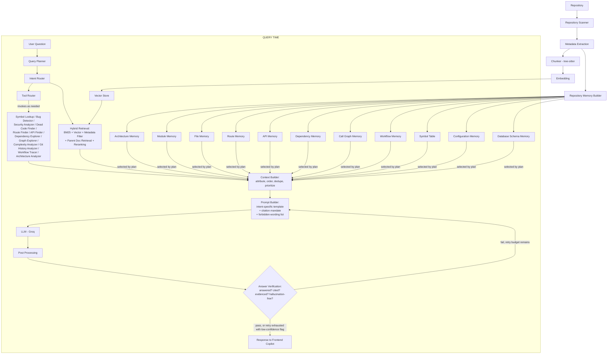

# COPILOT_REBUILD_PLAN.md

### CodeGraph — Master Engineering Plan for the AI Copilot Rebuild

_Internal design document. Written for implementation by AI coding agents (Codex, Antigravity, Devin, Cursor) working milestone by milestone._

---

# 1. Executive Summary

CodeGraph's indexing stack — repository scanning, tree-sitter parsing, embeddings, vector database, repository memory, dependency graph, architecture analysis — is real infrastructure and is not the source of the current failure. The system's own debugging confirms retrieved chunks are generally correct. The failure is downstream of retrieval, in the **orchestration layer**: the path from "chunks retrieved" to "answer returned."

### Root causes, ranked by likely contribution

1. **Undifferentiated prompting.** One generic system prompt handles every question type ("where is X called," "explain workflow Y," "review this for security issues"). LLMs mirror the specificity of their instructions — a generic instruction produces a generic answer shape, independent of context quality. This is the primary root cause.
2. **Unattributed context injection.** Retrieved chunks are almost certainly concatenated into a flat text blob without file path, line range, symbol name, or reason-for-selection attached to each chunk. Without that scaffolding, the model has nothing concrete to cite, so it defaults to talking _about_ the topic rather than _from_ the evidence.
3. **A monolithic Repository Memory document injected into every prompt.** If a single flattened "architecture summary" is attached regardless of question type, the model pattern-matches to continuing that document's own voice — which is very plausibly the literal source of the "Analysis Results / Key Findings / Recommendations" structure being observed. That heading pattern is characteristic of exactly this failure.
4. **No intent classification.** There is currently no branch point that treats "where is X called" (a lookup problem) differently from "explain the PDF upload workflow" (a multi-hop tracing problem) differently from "review this for security issues" (a problem requiring deterministic analysis, not just retrieval). All three currently funnel through the same pipeline and produce the same report-shaped output.
5. **No output contract or verification.** Nothing checks, before the answer is returned, whether it actually cited files/functions or whether it hallucinated. The system trusts the LLM's raw output unconditionally.

### Redesign philosophy

The rebuild is organized around one governing principle: **the system should never ask the LLM an open-ended question.** Every query, before it reaches the LLM, should be transformed into a fully specified task: a classified intent, a set of resolved entities, a retrieval strategy already executed, an attributed evidence set already assembled, and an output contract the model is instructed to fill. The LLM's job narrows from "be a helpful assistant for this codebase" to "fill in this specific, evidence-bound template." Generic answers are what happens when a capable model is given an underspecified task; the fix is specification, not a bigger model or more chunks.

A secondary principle: **treat Repository Memory as a queryable structured store, not a document.** Nothing gets injected into a prompt "by default" — every piece of context, whether a raw code chunk, a module summary, or a call-graph edge, is selected because the Intent Router or Query Planner determined it was relevant to _this_ question.

A third principle, carried through the whole plan: **prefer deterministic tools over LLM inference wherever a deterministic answer exists.** "Where is X called" is a symbol-table lookup, not a generation task. "Is this SQL query vulnerable to injection" is a pattern-match problem a security analyzer should answer, with the LLM narrating the finding — not a problem the LLM should reason about from scratch. RAG is the right tool for open-ended explanation and synthesis; it is the wrong tool for anything with a ground-truth answer sitting in the codebase's structure.

---

# 2. Current Architecture Review

| Stage                      | Purpose                                                                | Current Weakness                                                                                                                                                                        | Why It Hurts Answer Quality                                                                                                               | Priority     | Est. Effort |
| -------------------------- | ---------------------------------------------------------------------- | --------------------------------------------------------------------------------------------------------------------------------------------------------------------------------------- | ----------------------------------------------------------------------------------------------------------------------------------------- | ------------ | ----------- |
| **Repository Scanner**     | Walk repo, classify files, build file graph                            | Likely flat file list with extension-based language tagging only; no role classification (entrypoint/service/model/test/config)                                                         | Retrieval and prompting have no structural signal to prioritize e.g. service-layer files for an API question                              | Medium       | Low         |
| **Metadata Extraction**    | Per-file/per-symbol metadata: exports, imports, role, one-line summary | Likely path + language only; symbol-level metadata thin or absent                                                                                                                       | Lookup questions ("where is X called") can't be answered by symbol match, only by lossy vector similarity                                 | High         | Medium      |
| **Chunking (tree-sitter)** | Syntax-aware chunks at function/class boundaries with parent linkage   | Tree-sitter is in place (good), but likely missing parent-document linkage and role/symbol tagging on each chunk                                                                        | Even correct chunks lack the metadata needed for attribution in the prompt                                                                | Medium       | Low-Medium  |
| **Embedding**              | Vector representation of chunks for similarity search                  | Likely fine — not implicated by the observed symptom                                                                                                                                    | Not a likely contributor given citations already return correctly                                                                         | Low          | —           |
| **Vector Store**           | Store chunk vectors + metadata, filterable                             | Metadata fields likely thin (text + path only, no symbol/role/line-range as filterable fields)                                                                                          | Context Builder has nothing structured to build attribution from downstream                                                               | Medium       | Low-Medium  |
| **Repository Memory**      | Structured, multi-level summaries above raw chunks                     | Very likely a single flattened document injected into every prompt regardless of question                                                                                               | **Primary suspect** for the observed "Key Findings / Recommendations" voice — the model echoes the memory document's own report structure | **Critical** | Medium-High |
| **Retrieval (RAG)**        | Return relevant chunks for a query                                     | Single-strategy vector search for all query types; no hybrid search, no graph traversal, no intent-specific strategy                                                                    | Structural questions (lookup, workflow, dependency) are poorly served by pure similarity search                                           | High         | Medium      |
| **Query Processing**       | Understand and decompose the raw query                                 | Likely absent — raw string goes straight to embedding                                                                                                                                   | Multi-hop questions ("explain the workflow") have no mechanism to be decomposed into the sub-retrievals they actually require             | High         | Medium      |
| **Prompt Builder**         | Construct the LLM prompt from context + instructions                   | Single generic system prompt for all intents; context injected as unattributed blob                                                                                                     | **Primary suspect**, jointly with Repository Memory, for the generic-answer symptom                                                       | **Critical** | Medium      |
| **LLM (Groq)**             | Generate the answer                                                    | Not implicated — Groq-hosted open models are if anything more sensitive to prompt specificity than frontier models, which means prompt weaknesses show up _more_ clearly here, not less | Underlying model capability is not the bottleneck                                                                                         | Low          | —           |
| **Post Processing**        | Validate/reformat LLM output before returning it                       | Likely raw pass-through with no validation                                                                                                                                              | Nothing catches a generic answer before it reaches the user                                                                               | Medium       | Low-Medium  |
| **Citation**               | Attribute claims to files/lines                                        | Reported as working correctly, but disconnected from the answer body — citations return, but prose doesn't reference them                                                               | Citations exist but aren't load-bearing in the generated text                                                                             | Medium       | Low         |
| **Conversation Memory**    | Track entities/intent across turns                                     | Likely stateless or naive full-history injection                                                                                                                                        | Follow-up questions re-derive context from scratch and can regress to generic mode                                                        | Medium       | Medium      |
| **Confidence Scoring**     | Score answer reliability                                               | Likely absent                                                                                                                                                                           | No signal to the user (or to a retry loop) about answer reliability                                                                       | Low-Medium   | Low         |
| **Streaming**              | Token-by-token response delivery                                       | Orthogonal to grounding; not diagnostic to the symptom                                                                                                                                  | UX only                                                                                                                                   | Low          | Low         |

---

# 3. Target Architecture

```
Repository
    ↓
Repository Scanner  (file roles, directory graph, manifest)
    ↓
Metadata Extraction  (symbol tables, exports/imports, per-file summaries)
    ↓
Chunker  (tree-sitter, function/class boundaries, parent linkage)
    ↓
Embedding  (code-aware model; chunk-level + summary-level)
    ↓
Repository Memory Builder  (architecture / module / API / dependency /
                             call graph / route / symbol table / config /
                             db schema memories — built once, queried many times)
    ↓
──────────────── QUERY TIME (per user question) ────────────────
    ↓
Query Planner  (intent, entities, required modules/tools/memories,
                retrieval strategy, expected output structure)
    ↓
Intent Router  (selects pipeline: RAG-only / RAG+tools / graph traversal /
                static analysis+RAG / hybrid)
    ↓
Tool Router  (invokes deterministic tools as needed: symbol lookup,
              dependency explorer, security analyzer, bug detector, etc.)
    ↓
Hybrid Retrieval  (BM25 + vector, metadata-filtered, parent-document
                    expansion, reranked)
    ↓
Context Builder  (attributes every chunk: file, function, class, module,
                   lines, reason selected, relationship to question;
                   dedupes, orders, prioritizes)
    ↓
Prompt Builder  (intent-specific system + developer prompt, structured
                  context injection, explicit output contract, forbidden
                  generic-wording list)
    ↓
LLM (Groq)
    ↓
Post Processing  (parse structured output, attach citations)
    ↓
Answer Verification  (did we answer the question? cited files/functions?
                       evidence-backed? hallucination check — retry if not)
    ↓
Response  (to Frontend Copilot, streamed)
```

Two properties define this target architecture relative to the current one:

- **Everything before "QUERY TIME" happens once, at index time.** Everything after it happens fresh per question, and every stage after Intent Router is _conditioned on the classified intent_ — different intents take different paths through Tool Router, Hybrid Retrieval, and Prompt Builder. There is no longer a single undifferentiated pipeline.
- **Answer Verification is a closed loop, not a one-way pass-through.** A failed verification triggers a bounded retry with corrective instructions, not silent delivery of a generic answer.

---

# 4. Prompt Builder Redesign

## 4.1 Structural rules that apply to every template

**Context injection format** — every chunk, regardless of intent, is injected as:

```
[CHUNK N]
File: <path>
Function/Class: <symbol name, or "module-level">
Module: <logical module/package>
Lines: <start>–<end>
Reason Selected: <why the retriever chose this — e.g. "symbol match: generate_response">
---
<code>
```

**Citation rule (all templates):** Every factual claim about the codebase must reference a `[CHUNK N]` by file path and line range. If the answer requires information not present in the provided chunks or tool output, the model must say so explicitly rather than generalizing or inferring.

**Forbidden generic wording (all templates):** The system prompt explicitly bans, unless the question is genuinely open-ended: "Analysis Results," "Key Findings," "Repository Context," "Recommendations" as section headers, and hedge phrases like "typically," "in general," "codebases like this usually" when describing _this specific_ code.

## 4.2 Per-intent templates

### Architecture

- **System Prompt:** "You are describing the actual structure of this specific repository using the provided module summaries and dependency map. Organize the answer by architectural layer, not by file listing order."
- **Developer Prompt:** Injects architecture memory + relevant module memories + dependency map edges.
- **Output Format:** Layers (e.g., presentation / API / service / data) → components per layer → connections between layers, each backed by a citation.
- **Required Sections:** System Overview, Layers, Cross-Layer Connections, Key Design Decisions (only if evidenced by code comments/structure, not invented).
- **Citation Rules:** Every layer/component claim cites the module or file it's derived from.
- **Forbidden:** Generic software-architecture platitudes not evidenced by this repo's actual code.

### Workflow Tracing

- **System Prompt:** "Using the ordered chunks provided (sequenced by call order via the call graph), trace this request as it flows through each layer, in execution order. Do not skip layers even if the code is uninteresting."
- **Developer Prompt:** Injects workflow memory (if precomputed) or live call-graph traversal result, ordered.
- **Output Format:** Numbered steps; each step names one file/function and describes what happens before pointing to the next.
- **Required Sections:** Entry Point, Step-by-Step Trace, Exit/Response Point.
- **Citation Rules:** Each step cites its file:line.
- **Forbidden:** Describing the workflow "conceptually" without a concrete step sequence.

### Security Review

- **System Prompt:** "Evaluate only the code and security-analyzer findings provided. Confirm, refine, or reject each finding using the actual code. Do not speculate about code you were not shown."
- **Developer Prompt:** Injects Security Analyzer tool output + the exact code spans flagged.
- **Output Format:** Per finding: severity, file:line, the vulnerable pattern (quoted from the chunk, not paraphrased into something scarier or vaguer), remediation.
- **Required Sections:** Findings (by severity), Non-Findings (checks performed that passed, if relevant), Remediation Summary.
- **Citation Rules:** Every finding must map to a specific line span; no finding without one.
- **Forbidden:** Generic security checklists not tied to actual findings in this codebase.

### Bug Finding

- **System Prompt:** "You are given static-analysis findings and code context. Confirm or reject each finding using the actual code; do not invent issues absent from both the findings and the code."
- **Developer Prompt:** Injects Bug Detector tool output + surrounding code chunks.
- **Output Format:** Per issue: file:line, description, why it's a bug (not a style preference), suggested fix.
- **Required Sections:** Confirmed Issues, Suggested Fixes.
- **Citation Rules:** One citation per issue minimum.
- **Forbidden:** "Best practices" filler unconnected to an actual flagged issue.

### Code Explanation

- **System Prompt:** "Explain what this specific code does, using only the provided chunk(s). Do not describe what code like this typically does elsewhere."
- **Developer Prompt:** Injects the exact requested chunk plus direct callers/callees if available.
- **Output Format:** Purpose → line-by-line or block-by-block walkthrough → edge cases/gotchas evidenced in the code.
- **Required Sections:** Purpose, Walkthrough, Notes (edge cases only if present in code, e.g. error handling, guards).
- **Citation Rules:** Line-anchored throughout.
- **Forbidden:** Restating the code in prose without adding explanation ("this line sets x to 5" with no _why_).

### Refactoring Suggestions

- **System Prompt:** "Base every suggestion on the actual code shown and, where available, complexity/smell-detector output. Each suggestion must reference the specific lines it applies to."
- **Developer Prompt:** Injects target chunk + Complexity Analyzer output if available.
- **Output Format:** Per suggestion: current issue (cited), proposed change, rationale, risk/impact note.
- **Required Sections:** Current Issues, Proposed Changes, Risk Notes.
- **Citation Rules:** Every suggestion cites the lines it changes.
- **Forbidden:** Suggesting a rewrite without identifying what's concretely wrong with the current version.

### API Tracing

- **System Prompt:** "Trace this API call from its invocation site(s) through any wrapper/client layers to its definition or external boundary."
- **Developer Prompt:** Injects API Memory entry for the target API + call graph edges from invocation to definition.
- **Output Format:** Invocation site(s) → intermediate layers → definition/external boundary, each step cited.
- **Required Sections:** Call Sites, Call Chain, External Boundary (e.g., third-party SDK call).
- **Citation Rules:** Every hop in the chain cited.
- **Forbidden:** Describing the API "in general" instead of tracing this codebase's actual usage.

### Dependency Tracing

- **System Prompt:** "Using the dependency graph edges provided, describe what this module depends on and what depends on it. Do not infer dependencies not present in the graph."
- **Developer Prompt:** Injects Dependency Memory edges for the target module.
- **Output Format:** Upstream (depends on) / Downstream (depended on by), each with file citation.
- **Required Sections:** Upstream Dependencies, Downstream Dependents, Circular Dependency Warning (if applicable).
- **Citation Rules:** Every edge cited to its import statement.
- **Forbidden:** General statements about "tight coupling" without pointing to the specific edges.

### File Lookup

- **System Prompt:** "State the exact file(s) and line(s) where the requested symbol or pattern occurs. If multiple matches, list all with brief context. Do not elaborate beyond what was asked."
- **Developer Prompt:** Injects Symbol Table lookup result (primary) + semantic search fallback matches (secondary, clearly labeled as lower-confidence).
- **Output Format:** Direct list: file, line, one-line context.
- **Required Sections:** Matches (Symbol Table), Possible Related Matches (Semantic, if any) — clearly separated.
- **Citation Rules:** Every listed match is itself a citation.
- **Forbidden:** Prose padding around a lookup answer; "Recommendations" sections for a pure lookup question.

### Database Query

- **System Prompt:** "Describe database interactions using the provided schema memory and the actual query/ORM code shown. Do not assume a schema shape not evidenced by migrations/models."
- **Developer Prompt:** Injects Database Schema Memory + relevant model/query code chunks.
- **Output Format:** Schema relevant to the question → query/ORM usage → data flow.
- **Required Sections:** Relevant Schema, Query/ORM Usage, Data Flow Notes.
- **Citation Rules:** Schema claims cite migration/model files; query claims cite the query code.
- **Forbidden:** Inventing table/column names not present in schema memory.

### Configuration

- **System Prompt:** "Explain configuration using the actual config files and environment variable usage found in the repository. Do not assume standard defaults not present in the code."
- **Developer Prompt:** Injects Configuration Memory + config file chunks + code that reads each config value.
- **Output Format:** Config Key → Where Defined → Where Consumed → Effect.
- **Required Sections:** Config Inventory (relevant subset), Consumption Sites, Notes on Defaults/Overrides.
- **Citation Rules:** Every config key cites its definition file and every consumption site.
- **Forbidden:** Generic "12-factor app" advice not tied to this repo's actual config handling.

### Performance Analysis

- **System Prompt:** "Identify performance-relevant patterns using the actual code and, if available, Complexity Analyzer output. Do not speculate about runtime behavior without evidence in the code (e.g., loop nesting, N+1 query patterns, blocking calls)."
- **Developer Prompt:** Injects target code + Complexity Analyzer output + any relevant call-graph fan-out data.
- **Output Format:** Per concern: pattern identified (cited), why it's a concern, suggested mitigation.
- **Required Sections:** Identified Patterns, Mitigation Suggestions.
- **Citation Rules:** Every concern cites the specific lines exhibiting the pattern.
- **Forbidden:** Generic performance-tuning advice unconnected to an identified pattern in this code.

### Testing

- **System Prompt:** "Describe test coverage and structure using the actual test files found. If asked to suggest tests, base suggestions on the actual function signatures and branches in the target code, not generic test-writing advice."
- **Developer Prompt:** Injects target code + any existing test files covering it (matched by naming convention or import).
- **Output Format:** Existing Coverage (if any, cited) → Gaps → Suggested Test Cases tied to actual branches/edge cases in the code.
- **Required Sections:** Existing Tests, Coverage Gaps, Suggested Cases.
- **Citation Rules:** Existing tests cited to file; suggested cases reference the specific branch/condition in the target code they'd cover.
- **Forbidden:** Boilerplate "write unit tests for edge cases" without naming the actual edge cases present in the code.

---

# 5. Intent Router

## 5.1 Intent detection

A dedicated, fast classification call (Groq, small model, JSON-schema-constrained output) runs before retrieval. It outputs one primary intent from the fixed set defined in §4, plus:

```
intent: <primary intent>
secondary_intents: [<0 or more, for multi-intent queries>]
entities: [{ name, type }]   // e.g. {name: "Gemini API", type: "api"}
confidence: <0-1>
```

## 5.2 Entity extraction

Extracted jointly with intent classification, not as a separate pass — entities are typed (symbol, file, api, module, concept, config_key) so downstream retrieval knows whether to hit the Symbol Table, API Memory, or fall back to semantic search.

## 5.3 Multi-intent queries

Example: _"Explain the PDF upload workflow and flag any security issues in it."_ This decomposes into `workflow_tracing` (primary) + `security_review` (secondary) over the same entity ("PDF upload"). The Query Planner (§9) runs both pipelines against the same resolved entity set and the Prompt Builder uses a composite template: Workflow Trace section followed by a Security Findings section, both grounded in the same retrieved chunks where they overlap.

## 5.4 Query decomposition

For intents that are inherently multi-hop (workflow_tracing, architecture, dependency_tracing), the Query Planner expands one user query into an ordered list of sub-retrievals _before_ Hybrid Retrieval runs — e.g. "PDF upload workflow" decomposes into: frontend upload handler → API route → parser invocation → embedding call → vector store write. Each sub-retrieval targets one layer.

## 5.5 Routing table

| Intent               | Retrieval Strategy                                | Tools Invoked                         | Repo Memory Used                          |
| -------------------- | ------------------------------------------------- | ------------------------------------- | ----------------------------------------- |
| Architecture         | Module-summary retrieval                          | —                                     | Architecture Memory, Module Memory        |
| Workflow Tracing     | Graph traversal + semantic, decomposed by layer   | Workflow Tracer                       | Workflow Memory, Route Memory, Call Graph |
| Security Review      | Semantic + pattern match                          | Security Analyzer                     | Dependency Memory                         |
| Bug Finding          | Symbol/file-targeted + semantic                   | Bug Detector                          | Module Memory                             |
| Code Explanation     | Direct symbol/file retrieval                      | Symbol Lookup                         | —                                         |
| Refactoring          | Symbol-targeted + semantic                        | Complexity Analyzer, Dead Code Finder | Module Memory                             |
| API Tracing          | Symbol table + call graph                         | API Finder, Graph Explorer            | API Memory, Call Graph                    |
| Dependency Tracing   | Dependency graph query                            | Dependency Explorer                   | Dependency Memory                         |
| File Lookup          | Symbol table first, semantic fallback             | Symbol Lookup                         | Symbol Table                              |
| Database Query       | Schema lookup + code retrieval                    | Route Finder (for query call sites)   | Database Schema Memory                    |
| Configuration        | Config memory + usage-site retrieval              | Symbol Lookup                         | Configuration Memory                      |
| Performance Analysis | Symbol-targeted + semantic                        | Complexity Analyzer, Graph Explorer   | Call Graph                                |
| Testing              | File-pattern retrieval (test files) + target code | Symbol Lookup                         | Module Memory                             |

## 5.6 Fallback logic

If intent-classification confidence is below threshold (e.g. 0.6), or the query matches no intent well, route to a **General Explanation** fallback: hybrid retrieval + the Code Explanation template, still with full citation rules and the forbidden-wording list enforced — never fall back to a truly generic "assistant" prompt. There is no code path in the redesigned system that reaches the LLM without an intent-specific (or fallback-but-still-structured) template.

---

# 6. Repository Memory Redesign

Each memory type is a **separately built, separately queryable artifact** — never concatenated into one document injected everywhere.

| Memory                     | Built From                                                                                    | Built How                                                                                                                           | Retrieved When                                                                                  |
| -------------------------- | --------------------------------------------------------------------------------------------- | ----------------------------------------------------------------------------------------------------------------------------------- | ----------------------------------------------------------------------------------------------- |
| **Architecture Memory**    | Directory structure, module boundaries, entrypoints                                           | LLM-assisted summarization over module memories (bottom-up), validated against actual directory/import structure                    | Architecture-intent queries only                                                                |
| **Module Memory**          | Per-module file set                                                                           | Per-module LLM summary of purpose/responsibilities, generated from constituent file summaries                                       | Architecture, refactoring, bug-finding (for context), testing                                   |
| **File Memory**            | Per-file content                                                                              | One-line LLM summary per file, generated at index time                                                                              | Used for ranking/filtering candidates; rarely injected raw into prompts                         |
| **Route Memory**           | Router/framework registration code (Flask/Express/FastAPI/etc. route decorators)              | Static extraction (AST pattern match on route-registration calls) — not LLM-generated, since this is deterministic                  | Workflow tracing (web request entry points), API tracing                                        |
| **API Memory**             | External API client calls (e.g., `requests.post`, SDK client method calls)                    | Static extraction: identify calls to known external-SDK patterns, map call site → wrapper → definition                              | API tracing, security review (external call surface)                                            |
| **Dependency Memory**      | Import/export statements across all files                                                     | Static extraction (AST-based import graph)                                                                                          | Dependency tracing, architecture, circular-dependency detection                                 |
| **Call Graph Memory**      | Function/method call relationships                                                            | Static extraction via tree-sitter (call expressions resolved to definitions where possible; cross-file resolution via symbol table) | Workflow tracing, API tracing, performance analysis                                             |
| **Workflow Memory**        | Precomputed traces of common request paths (upload flows, auth flows, checkout flows, etc.)   | Built by running Call Graph + Route Memory traversal from each detected entrypoint, cached                                          | Workflow tracing (skip live traversal when a cached trace exists)                               |
| **Symbol Table**           | Every function/class/const definition                                                         | Static extraction (tree-sitter), one row per symbol: name, file, lines, kind, signature                                             | File lookup (checked _first_, before semantic search), all intents needing "where is X defined" |
| **Configuration Memory**   | Config files (.env.example, config/\*.yaml, settings modules) + code sites that read each key | Static extraction: parse config files for keys, grep/AST-match code for read access to each key                                     | Configuration-intent queries                                                                    |
| **Database Schema Memory** | Migration files, ORM model definitions                                                        | Static extraction: parse model classes / migration DDL into table→columns→relationships                                             | Database-query-intent, some architecture questions                                              |

**Key rule:** everything that _can_ be extracted deterministically (Symbol Table, Dependency Memory, Call Graph, Route Memory, API Memory, Database Schema Memory, Configuration Memory) **should be**, via tree-sitter/AST parsing rather than LLM generation. Reserve LLM summarization specifically for the two memories that are inherently interpretive (Architecture Memory, Module Memory, File Memory one-liners). This split matters for two reasons: deterministic memories are exact (no hallucination risk in the memory layer itself) and are far cheaper to keep in sync as the repo changes — they can be incrementally recomputed on file change rather than requiring an LLM call.

---

# 7. Retrieval Pipeline

| Technique                         | Include?                                | Rationale                                                                                                                                                                                                                                                                                                              |
| --------------------------------- | --------------------------------------- | ---------------------------------------------------------------------------------------------------------------------------------------------------------------------------------------------------------------------------------------------------------------------------------------------------------------------- |
| **Hybrid Search (BM25 + Vector)** | **Yes**                                 | Code questions frequently target exact identifiers ("Gemini," `generate_response`) that BM25 catches and pure vector similarity often ranks too low. Merge candidate sets from both before reranking.                                                                                                                  |
| **Metadata Filters**              | **Yes**                                 | Once Metadata Extraction (§2) tags role/language/module, filter candidate chunks by role when intent implies it (e.g., "API call" questions filter toward service/client-role files first).                                                                                                                            |
| **Parent Document Retrieval**     | **Yes**                                 | Retrieve at chunk granularity for match precision, return the parent function/file for completeness — directly fixes function-split-across-chunk-boundary failures.                                                                                                                                                    |
| **Cross-Encoder Reranking**       | **Yes**                                 | Applied after hybrid search merges candidates; meaningfully improves top-k precision at low marginal cost.                                                                                                                                                                                                             |
| **Graph Retrieval**               | **Yes, intent-gated**                   | Invoked specifically for workflow_tracing, dependency_tracing, api_tracing via the Tool Router — not run as a default strategy for every query.                                                                                                                                                                        |
| **Query Expansion**               | **Partial — subsumed by Query Planner** | Rather than generic query expansion, the Query Planner's decomposition (§5.4, §9) already produces the equivalent of expanded sub-queries, targeted per intent. Don't build both as separate systems.                                                                                                                  |
| **Multi-Query Retrieval**         | **Situational**                         | Useful specifically for architecture/workflow intents where the decomposed sub-queries (§5.4) each get their own retrieval pass — this is effectively multi-query retrieval already, scoped by intent rather than applied blanket.                                                                                     |
| **Chunk Ranking**                 | **Yes**                                 | Final ranking combines: reranker score, metadata-filter match, and (for graph-retrieved chunks) graph-traversal order — workflow/API-trace chunks are ranked by execution order, not by similarity score, once graph retrieval has run.                                                                                |
| **Chunk Deduplication**           | **Yes**                                 | Dedupe by symbol identity (same function retrieved via both BM25 and vector paths) before Context Builder assembly — never show the model the same function twice under different chunk IDs.                                                                                                                           |
| **Context Compression**           | **No, not initially**                   | Skip until the redesigned Context Builder (attributed, deduplicated, intent-scoped chunks) is shown empirically to exceed context budget. Compression adds an LLM call, cost, latency, and a new hallucination surface for a problem the other fixes mostly prevent. Revisit only if measured context overflow occurs. |

---

# 8. Tool Calling Architecture

The Tool Router sits between Intent Router and Hybrid Retrieval. Tools are deterministic, non-generative functions; their output is injected into the prompt as evidence, and the LLM narrates/formats it rather than regenerating it from scratch.

| Tool                      | Invoked For                                         | What It Does                                                                                                  | Output Consumed By                                                                     |
| ------------------------- | --------------------------------------------------- | ------------------------------------------------------------------------------------------------------------- | -------------------------------------------------------------------------------------- |
| **Symbol Lookup**         | File Lookup, Code Explanation, Configuration        | Exact/fuzzy match against Symbol Table                                                                        | Prompt Builder (File Lookup, Code Explanation templates)                               |
| **Bug Detector**          | Bug Finding                                         | Runs static linters + known-antipattern AST matches over target scope                                         | Bug Finding template                                                                   |
| **Security Analyzer**     | Security Review                                     | Runs security ruleset (injection patterns, hardcoded secrets, unsafe deserialization, etc.) over target scope | Security Review template                                                               |
| **Dead Code Finder**      | Refactoring (on request)                            | Cross-references Symbol Table definitions against Call Graph incoming edges to flag unreferenced symbols      | Refactoring template                                                                   |
| **Route Finder**          | Workflow Tracing, Database Query                    | Queries Route Memory for entrypoints matching the query's feature/entity                                      | Workflow Tracing template                                                              |
| **API Finder**            | API Tracing                                         | Queries API Memory for the target API's call sites and definition                                             | API Tracing template                                                                   |
| **Dependency Explorer**   | Dependency Tracing                                  | Queries Dependency Memory graph for upstream/downstream edges of the target module                            | Dependency Tracing template                                                            |
| **Graph Explorer**        | Workflow Tracing, API Tracing, Performance Analysis | Traverses Call Graph Memory from a given entrypoint or symbol, N hops or until exit boundary                  | Workflow/API Tracing, Performance Analysis templates                                   |
| **Complexity Analyzer**   | Refactoring, Performance Analysis                   | Computes cyclomatic complexity / nesting depth / fan-out per function in target scope                         | Refactoring, Performance Analysis templates                                            |
| **Git History Analyzer**  | Bug Finding (on request), Refactoring (on request)  | Pulls recent change frequency / blame info for target files, when repo includes `.git`                        | Adds "recently changed" context, invoked only when explicitly relevant, not by default |
| **Workflow Tracer**       | Workflow Tracing                                    | Combines Route Finder + Graph Explorer into one ordered, cached trace                                         | Workflow Tracing template                                                              |
| **Architecture Analyzer** | Architecture                                        | Aggregates Module Memory + Dependency Memory into a layer-grouped structure                                   | Architecture template                                                                  |

**Invocation rule:** the Intent Router's routing table (§5.5) determines which tools are _candidates_ for a given intent; the Query Planner (§9) decides, per specific query, which of those candidates are actually invoked (e.g., a Security Review query about one file doesn't need Git History Analyzer unless the user specifically asks about _recent_ changes). Tools are never invoked speculatively "just in case" — every tool call should be traceable to a specific need identified by the Query Planner.

---

# 9. Query Planner

The Query Planner sits between Intent Router and the rest of the pipeline. It is the reasoning stage that turns "explain the PDF upload workflow" into a concrete execution plan, and it is what makes the rest of the pipeline mechanical rather than another place where genericness can creep back in.

**Input:** raw query + classified intent + extracted entities (from §5).

**Output (structured plan):**

```
intent: workflow_tracing
entities: [{name: "PDF upload", type: "concept"}]
required_modules: [upload-handler, parser, embedding-service, vector-store-client]
required_tools: [route_finder, graph_explorer]
required_memories: [workflow_memory, route_memory, call_graph]
retrieval_strategy: graph_traversal_from_entrypoint
  entrypoint_hint: "route matching /upload or /pdf in Route Memory"
expected_output_structure: numbered_step_trace
```

This plan is what the Tool Router, Hybrid Retrieval, and Prompt Builder each consume — none of them re-derive intent or strategy independently; they execute the plan. This avoids the current-system failure where every stage implicitly assumes "just do generic RAG" because nothing upstream ever specified otherwise.

For simple intents (File Lookup, Code Explanation of a named symbol), the plan is nearly trivial (`retrieval_strategy: symbol_table_lookup`, no tools needed) — the Query Planner should be a cheap, fast step for these cases, not a mandatory heavyweight reasoning call. Only intents requiring decomposition or tool orchestration (workflow_tracing, architecture, security_review, dependency_tracing) warrant the fuller planning output above.

---

# 10. Context Builder

Every chunk delivered to the Prompt Builder — regardless of source (hybrid retrieval, graph traversal, tool output) — is normalized into one structure:

```
{
  file: "src/services/gemini_client.py",
  function: "generate_response",
  class: null,
  module: "services",
  lines: [34, 61],
  reason_selected: "symbol match on entity 'Gemini API'; confirmed via API Memory call-site index",
  code: "<the actual code>",
  relationship_to_question: "this is the direct call site for the API named in the question"
}
```

**Ordering:** default order is retrieval-confidence descending, _except_ for workflow_tracing and API_tracing intents, where order is overridden to execution order (from Graph Explorer's traversal) regardless of retrieval score — the reader needs to see the trace in the order things actually happen, not in order of similarity score.

**Deduplication:** chunks are deduped by `(file, lines)` overlap before assembly — if hybrid search and graph traversal both surface the same function, it appears once, with `reason_selected` combining both justifications.

**Prioritization under context budget:** when the assembled context would exceed the model's usable window, prioritize in this order: (1) chunks with direct entity match (symbol/API name match), (2) chunks in the execution/dependency path for the classified intent, (3) highest-reranked semantic matches, (4) summary-level memory (module/file summaries) as a fallback for anything cut. Never silently drop the top-ranked, directly-matched chunk to make room for a summary — cut from the bottom of the priority order, and if truncation happens, the Prompt Builder is told explicitly ("N additional lower-relevance matches were omitted for length") so the model doesn't imply completeness it doesn't have.

---

# 11. Answer Verification

A lightweight verification pass runs on the LLM's raw output before it's returned, checking four things, each with a concrete automatable check where possible:

1. **Did we answer the user's question?** — Compare the classified intent's `expected_output_structure` (from the Query Planner) against the actual output's structure (e.g., did a `file_lookup` query actually return a file:line, or did it return prose?). Structural mismatch → fail.
2. **Did we cite files?** — Regex/parse the output for `[CHUNK N]`-style references or explicit `file:line` mentions; an answer with zero citations on an intent that requires them (all except pure architecture-overview cases) → fail.
3. **Did we reference evidence for every claim?** — Heuristic: flag sentences making a factual claim about the code (contains a symbol/file name pattern) with no nearby citation → fail if above a threshold proportion.
4. **Did we hallucinate?** — Cross-check every cited file:line against the actual Context Builder payload sent in the prompt (not against the whole repo) — if the model cites a file/line that was never in its context, that's a fabricated citation → fail.

**On failure:** retry once, automatically, with a corrective developer-prompt addendum naming the specific failure (e.g., "Your previous answer contained no file citations. Rewrite it, citing the exact file and line for every claim about the code, using only the chunks provided.") If the retry also fails verification, return the answer with a visible low-confidence flag rather than a silent generic fallback — the user should never see a confidently-generic answer, but should also never be blocked entirely by an infinite retry loop. Cap retries at 1.

This closes the loop that's currently entirely open: today, whatever the LLM produces is what the user sees. After this stage, a generic answer is a _detected, correctable_ failure mode rather than an invisible one.

---

# 12. Engineering Roadmap

### Milestone 1 — Context Builder + Prompt Builder Redesign

- **Goal:** Attributed chunk injection (file/function/lines/reason) + intent-agnostic-but-structured prompt with citation mandate and forbidden-wording list, as an interim step before full Intent Router exists.
- **Files likely affected:** context assembly module, prompt template module/config, system prompt definitions.
- **Difficulty:** Low.
- **Estimated impact:** High — expected to resolve the majority of the observed symptom on its own.
- **Dependencies:** None — can start immediately.
- **Testing strategy:** Re-run the two example queries from the review ("where is the Gemini API called," "explain the PDF upload workflow") before/after; manually verify citation presence and absence of generic headers.
- **Expected improvement:** Grounded, file/line-cited answers replacing generic report structure.

### Milestone 2 — Repository Memory Split

- **Goal:** Break the monolithic repo-memory document into the eleven separate memories in §6; deterministic ones (Symbol Table, Dependency, Call Graph, Route, API, Config, DB Schema) built via AST/tree-sitter extraction, interpretive ones (Architecture, Module, File) via scoped LLM summarization.
- **Files likely affected:** repository memory builder, indexing pipeline, new per-memory-type extractors, memory query interface.
- **Difficulty:** Medium-High (deterministic extractors are mechanical but numerous; interpretive summarizers need prompt design of their own, scoped per-module rather than whole-repo).
- **Estimated impact:** High.
- **Dependencies:** Benefits from Milestone 1's context-attribution conventions (reuse the same file/line/symbol schema).
- **Testing strategy:** Unit tests per extractor against known small repos with hand-verified expected output (e.g., a fixture repo with 3 known routes, 2 known API calls).
- **Expected improvement:** Removes the "everything sounds like a repo summary" bias; enables every subsequent intent-specific template to pull exactly the memory it needs.

### Milestone 3 — Intent Router + Query Planner

- **Goal:** Add intent classification, entity extraction, and the structured execution plan (§9) as the first stage of the per-query pipeline; route to Milestone 1's templates by intent.
- **Files likely affected:** new intent classifier module, new query planner module, pipeline orchestrator, prompt builder (template selection logic).
- **Difficulty:** Medium.
- **Estimated impact:** High — this is what makes different question _types_ actually behave differently.
- **Dependencies:** Milestone 1 (templates to route to), Milestone 2 (memories to reference in plans).
- **Testing strategy:** A labeled eval set of ~30-50 representative queries across all 13 intents, checking classifier accuracy and correct routing table application.
- **Expected improvement:** "Where is X" and "explain workflow Y" now visibly diverge in structure and evidence used.

### Milestone 4 — Hybrid Retrieval + Reranking

- **Goal:** Add BM25 index alongside existing vector search; merge and cross-encoder-rerank candidates; add metadata filtering by role/module.
- **Files likely affected:** retrieval pipeline module, vector store query layer, new BM25 index, new reranking call/service.
- **Difficulty:** Medium.
- **Estimated impact:** Medium — precision improvement on top of an already-grounded system.
- **Dependencies:** Milestone 1/2 for the metadata fields to filter/rerank on.
- **Testing strategy:** Retrieval precision@k on a held-out set of (query, expected-file) pairs before/after.
- **Expected improvement:** Better top-k chunk selection, especially for exact-identifier lookup queries.

### Milestone 5 — Tool Router + Deterministic Tools

- **Goal:** Implement the 12 tools in §8, wired to the Intent Router's routing table and invoked per the Query Planner's plan.
- **Files likely affected:** new tool modules (one per tool, several reusing Milestone 2's deterministic extractors), tool router/dispatcher, prompt builder (tool-output injection).
- **Difficulty:** Medium-High (Security Analyzer and Bug Detector are the most involved; several tools are thin wrappers over Milestone 2 memories).
- **Estimated impact:** High, specifically for bug-finding, security-review, and performance-analysis intents, which are currently ungrounded RAG-only.
- **Dependencies:** Milestone 2 (most tools query the structured memories), Milestone 3 (routing).
- **Testing strategy:** Fixture repos with known, injected bugs/vulnerabilities to verify each tool's detection accuracy independently of the LLM.
- **Expected improvement:** Bug/security/performance answers backed by deterministic findings rather than LLM speculation.

### Milestone 6 — Graph Retrieval (Call Graph / Workflow Tracing)

- **Goal:** Full call-graph traversal from entrypoints, cached as Workflow Memory; wire into Workflow Tracer and Graph Explorer tools.
- **Files likely affected:** call graph builder (extends Milestone 2), graph traversal module, Workflow Tracer/Graph Explorer tool implementations.
- **Difficulty:** High — cross-file, cross-language call resolution is the hardest single piece of this plan.
- **Estimated impact:** High, scoped specifically to multi-hop questions (workflow, API trace, dependency trace) — this is what makes "explain the PDF upload workflow" answerable as an actual trace rather than a similarity-search summary.
- **Dependencies:** Milestone 2 (Symbol Table, Route Memory as inputs to graph resolution).
- **Testing strategy:** Hand-traced fixture workflows (e.g., a small Flask app with a known 4-step request path) verified against traversal output.
- **Expected improvement:** Directly closes the "explain the PDF upload workflow" gap that no amount of single-shot retrieval improvement fully solves.

### Milestone 7 — Answer Verification + Retry Loop

- **Goal:** Implement the four checks in §11 and the bounded-retry corrective loop.
- **Files likely affected:** new verification module, post-processing pipeline, prompt builder (corrective-addendum templates).
- **Difficulty:** Medium.
- **Estimated impact:** Medium-High — a safety net that catches regressions in any of the above milestones, and the first line of defense if a new intent template is added later without full testing.
- **Dependencies:** Milestone 1 (citation format to check against), Milestone 3 (expected_output_structure from Query Planner to check against).
- **Testing strategy:** Adversarial test set — deliberately truncate/corrupt context in test runs and confirm verification catches the resulting citation failures.
- **Expected improvement:** Generic or hallucinated answers become a visible, retried, or flagged event instead of a silent delivery.

### Milestone 8 — Conversation Memory + Confidence Scoring

- **Goal:** Multi-turn entity/intent resolution ("it," "that function" resolve to prior turn's resolved entity); confidence score surfaced per answer based on retrieval/verification signal strength.
- **Files likely affected:** conversation state manager, confidence scoring function, frontend response schema (to surface confidence).
- **Difficulty:** Medium.
- **Estimated impact:** Medium — UX/reliability polish rather than a core grounding fix.
- **Dependencies:** Milestone 3 (entity extraction to carry across turns), Milestone 7 (verification signal as a confidence input).
- **Testing strategy:** Multi-turn conversation scripts with pronoun/reference follow-ups, checked for correct entity resolution.
- **Expected improvement:** Follow-up questions stay grounded without needing the user to restate context.

---

# 13. Future Features (Post-Rebuild)

Evaluated for genuine fit with CodeGraph, not included wholesale:

- **Inline "explain this selection" mode (Cursor/Copilot-style)** — reuses the Code Explanation template directly against a frontend-selected code range instead of a search-derived chunk; low additional engineering cost given Milestone 1, high UX value.
- **Diff-aware review (Copilot/Cursor PR-review style)** — extend Bug Detector/Security Analyzer to run against a git diff instead of a static snapshot; valuable once Git History Analyzer (Milestone 5) exists, since diff context is a natural extension of it.
- **Agentic multi-step task execution (Devin-style)** — deliberately **excluded from this plan's scope**. CodeGraph's stated goal is a grounded _Copilot_ (question-answering and analysis), not an autonomous code-modification agent; adding write-access agentic execution is a materially different trust and safety surface and should be a separate design document if pursued, not bundled into this rebuild.
- **Repo-wide semantic changelog generation (Sourcegraph Cody-style)** — feasible on top of Workflow Memory + Git History Analyzer once both exist; worth a future milestone but not part of this rebuild's core loop.
- **"Explain this error message" mode (Continue.dev/Aider-style)** — takes a stack trace as input, resolves each frame to Symbol Table entries, and runs the Code Explanation template across the resolved call chain; cheap to add once Symbol Table (Milestone 2) and Graph Explorer (Milestone 5) exist.
- **Local model fallback for privacy-sensitive repos** — worth flagging as an infrastructure option (swap Groq for a local model behind the same Prompt Builder contract) since the whole point of this redesign is that grounding lives in orchestration, not in which LLM is called; genuinely low-cost to support given the architecture, not a reason to delay the rebuild.
- **Windsurf-style "cascade" multi-file awareness** — largely already covered by this plan's Context Builder + Graph Retrieval; not a separate feature to build, just an outcome of Milestones 2/4/6 done well.

Explicitly **not recommended**: full autonomous agent loops, auto-applying refactors without user confirmation, and speculative "predict what you'll ask next" pre-fetching — all add complexity and trust-surface disproportionate to CodeGraph's current stated goal of being a grounded, explainable code Copilot.

---

# 14. Final Architecture Diagram



---

_End of COPILOT_REBUILD_PLAN.md._
