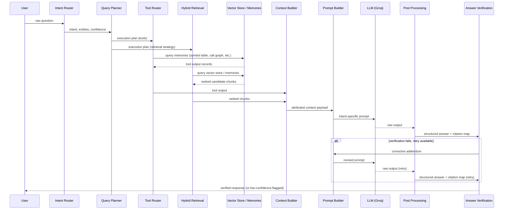

# DATA_FLOW.md

### CodeGraph — End-to-End Data Flow

_Derived from COPILOT_REBUILD_PLAN.md. Scope: what data exists, in what shape, at every hop — from raw repository bytes to a returned answer. Component responsibilities live in SYSTEM_ARCHITECTURE.md; retrieval mechanics live in RAG_PIPELINE.md. This document traces the data itself, including one fully worked example._

---

## 1. Two Data Lifecycles

CodeGraph has two independent data lifecycles that meet at query time:

- **Index-time data** is written once per repository (or incrementally on file change) and persists across many queries. It lives in the Vector Store and the 11 Repository Memory stores.
- **Query-time data** is created fresh per question, flows through the pipeline in one direction, and is discarded after the answer is returned (except for the entity/intent summary retained by Conversation Memory for the next turn).

No query-time process writes back to index-time storage. The boundary is one-directional.

---

## 2. Index-Time Data Flow

```
Raw repository bytes
    ↓  [Repository Scanner]
File manifest: { path, role, directory_graph_edges }
    ↓  [Metadata Extraction]
File metadata: { path, exports[], imports[], role, one_line_summary }
    ↓  [Chunker]
Chunk records: { chunk_id, file, symbol, symbol_kind, module,
                 lines, role, parent_chunk_id, text }
    ↓  [Embedding]
Chunk records + vector[]  (chunk-level and summary-level)
    ↓  [Vector Store — persisted]
Queryable index: vectors + filterable metadata (file, symbol, role, lines)

    (in parallel, from File Metadata + Chunk records)
    ↓  [Repository Memory Builder]
11 independent memory stores — persisted:
    Architecture Memory, Module Memory, File Memory   (LLM-generated)
    Route Memory, API Memory, Dependency Memory,
    Call Graph Memory, Workflow Memory, Symbol Table,
    Configuration Memory, Database Schema Memory       (statically extracted)
```

**At rest after index time:** Vector Store (chunk vectors + metadata) and 11 Memory Stores. These are the only two categories of persisted, query-independent data in the system.

---

## 3. Query-Time Data Flow

```
User question (raw string)
    ↓  [Intent Router]
{ intent, secondary_intents[], entities[], confidence }
    ↓  [Query Planner]
Execution Plan:
{ intent, entities[], required_modules[], required_tools[],
  required_memories[], retrieval_strategy, entrypoint_hint,
  expected_output_structure }
    ↓  splits into two parallel branches
    │
    ├──[Tool Router]──→ invokes tools named in required_tools
    │                    → Tool output records (findings, lookups, traces)
    │
    └──[Hybrid Retrieval]──→ queries Vector Store + relevant Memory stores
                              → Ranked candidate chunks
    ↓  (both branches feed in)
[Context Builder]
    ↓  dedupe, order, prioritize
Context Payload: ordered list of
{ file, function, class, module, lines,
  reason_selected, code, relationship_to_question }
    ↓  [Prompt Builder]
Final Prompt: { system_prompt (intent-specific), developer_prompt
                (context payload injected, attributed), citation_mandate,
                forbidden_wording_constraint }
    ↓  [LLM — Groq]
Raw model output (text, possibly structured per output contract)
    ↓  [Post Processing]
Structured Answer + citation_map: { claim → [chunk_id, ...] }
    ↓  [Answer Verification]
Verification Result:
{ intent_match, has_citations, evidence_coverage,
  hallucinated_citations[], passed, retry_count }
    │
    ├── fail, retry budget remains ──→ back to [Prompt Builder]
    │                                   with corrective addendum
    │
    └── pass, or retry exhausted ──→ Response
                                       { answer, citations, confidence,
                                         low_confidence_flag? }
    ↓  [Conversation Memory]
Resolved entity/intent summary persisted for next turn only
    ↓
Frontend Copilot (streamed)
```

**Nothing here is persisted beyond the single query-response cycle**, except the entity/intent summary Conversation Memory carries into the next turn of the same session.

---

## 4. Worked Example — Full Data Trace

Query: **"Where is the Gemini API called?"**

**Step 1 — Intent Router output:**

```
{ intent: "file_lookup", secondary_intents: [],
  entities: [{ name: "Gemini API", type: "api" }],
  confidence: 0.94 }
```

**Step 2 — Query Planner output (execution plan):**

```
{ intent: "file_lookup",
  entities: [{ name: "Gemini API", type: "api" }],
  required_modules: [],
  required_tools: ["symbol_lookup"],
  required_memories: ["symbol_table", "api_memory"],
  retrieval_strategy: "symbol_table_lookup",
  entrypoint_hint: null,
  expected_output_structure: "direct_match_list" }
```

**Step 3 — Tool Router:** invokes `symbol_lookup` against Symbol Table and API Memory for entity "Gemini API." Returns:

```
[
  { file: "src/services/gemini_client.py", symbol: "generate_response",
    lines: [34, 61], kind: "function" },
  { file: "src/routes/chat.py", symbol: "ChatRouter.handle_message",
    lines: [12, 28], kind: "method" }
]
```

**Step 4 — Hybrid Retrieval:** since `retrieval_strategy` is `symbol_table_lookup`, hybrid semantic search runs only as a secondary fallback pass (in case the symbol match is incomplete). Suppose it returns one additional, lower-confidence candidate:

```
[{ chunk_id: "c_881", file: "docs/architecture.md",
   text: "...integration with Gemini for response generation...",
   score: 0.41 }]
```

**Step 5 — Context Builder:** merges tool output + retrieval output, dedupes (no overlap here), ranks (direct symbol matches pinned above the low-confidence doc match), and normalizes:

```
[
  { file: "src/services/gemini_client.py", function: "generate_response",
    class: null, module: "services", lines: [34, 61],
    reason_selected: "symbol_table match on entity 'Gemini API'",
    code: "<function source>",
    relationship_to_question: "direct call site for the Gemini API" },

  { file: "src/routes/chat.py", function: "ChatRouter.handle_message",
    class: "ChatRouter", module: "routes", lines: [12, 28],
    reason_selected: "call graph edge into generate_response",
    code: "<method source>",
    relationship_to_question: "caller of the direct call site" },

  { file: "docs/architecture.md", function: null, class: null,
    module: "docs", lines: [0, 0],
    reason_selected: "low-confidence semantic match (score 0.41)",
    code: "<doc excerpt>",
    relationship_to_question: "mentions Gemini integration; not a call site" }
]
```

**Step 6 — Prompt Builder:** selects the File Lookup template (§4.2 of the rebuild plan), injects the three attributed records above with `[CHUNK 1]`/`[CHUNK 2]`/`[CHUNK 3]` headers, and instructs the model to list matches directly, separating Symbol Table matches from lower-confidence semantic matches, with no elaboration beyond what was asked.

**Step 7 — LLM output (raw):**

```
Matches (Symbol Table):
- src/services/gemini_client.py:34-61 — generate_response()
- src/routes/chat.py:12-28 — ChatRouter.handle_message()

Possible Related Matches (Semantic):
- docs/architecture.md — mentions Gemini integration, not a call site
```

**Step 8 — Post Processing:** attaches `citation_map`:

```
{ "generate_response() call site": ["chunk c_gemini_client_34_61"],
  "ChatRouter.handle_message() caller": ["chunk c_chat_12_28"] }
```

**Step 9 — Answer Verification:**

```
{ intent_match: true,        // output structure matches "direct_match_list"
  has_citations: true,
  evidence_coverage: 1.0,
  hallucinated_citations: [],
  passed: true, retry_count: 0 }
```

**Step 10 — Response returned to Frontend Copilot**, streamed, with `confidence: high`.

This trace is the concrete illustration of the architectural rule stated in the rebuild plan's Executive Summary: the LLM at Step 7 never received an open-ended question — by the time it ran, the task was already reduced to "list these three specific, pre-attributed matches in this specific format."

---

## 5. Data at Rest vs. Data in Motion

| Category                                 | Examples                                                                                  | Lifespan                                          | Written By                                                                                             | Read By                                   |
| ---------------------------------------- | ----------------------------------------------------------------------------------------- | ------------------------------------------------- | ------------------------------------------------------------------------------------------------------ | ----------------------------------------- |
| **At rest — index-time**                 | Vector Store, 11 Memory Stores                                                            | Persists until next re-index / incremental update | Repository Memory Builder, Embedding                                                                   | Hybrid Retrieval, Tool Router             |
| **In motion — per query**                | Execution Plan, Tool output, Context Payload, Prompt, Raw LLM output, Verification Result | One query-response cycle                          | Query Planner, Tool Router, Context Builder, Prompt Builder, LLM, Post Processing, Answer Verification | Next stage in the same pipeline pass only |
| **At rest — cross-turn, session-scoped** | Conversation Memory's resolved entity/intent summary                                      | One conversation session                          | Conversation Memory                                                                                    | Query Planner (next turn)                 |

---

## 6. Sequence Diagram



---

_End of DATA_FLOW.md._
