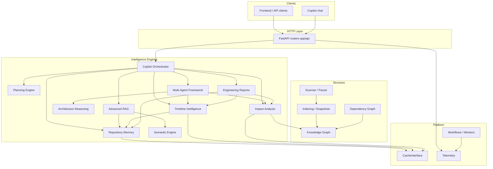

# Architecture Overview

CodeGraph is a layered FastAPI intelligence platform. Engines compose; APIs stay thin.



## Request flow (Copilot)

```text
POST /copilot/chat
  → PlanningEngine.plan
  → ContextBuilder (Memory + RAG + conversation)
  → ToolExecutor (existing engines)
  → ProviderManager (LLM / local heuristic)
  → structured engineering response
```

## Design principles

1. **Composition over duplication** — never reimplement indexing, traversal, retrieval, or domain scoring.
2. **Thin controllers** — routers validate, call engines, map errors.
3. **Provider seams** — cache, history, LLM providers swap without rewriting facades.
4. **Planning owns orchestration** — multi-agent and Copilot tools follow planning intents.

Authoritative detail: [`AI_CONTEXT/ARCHITECTURE.md`](../AI_CONTEXT/ARCHITECTURE.md).
