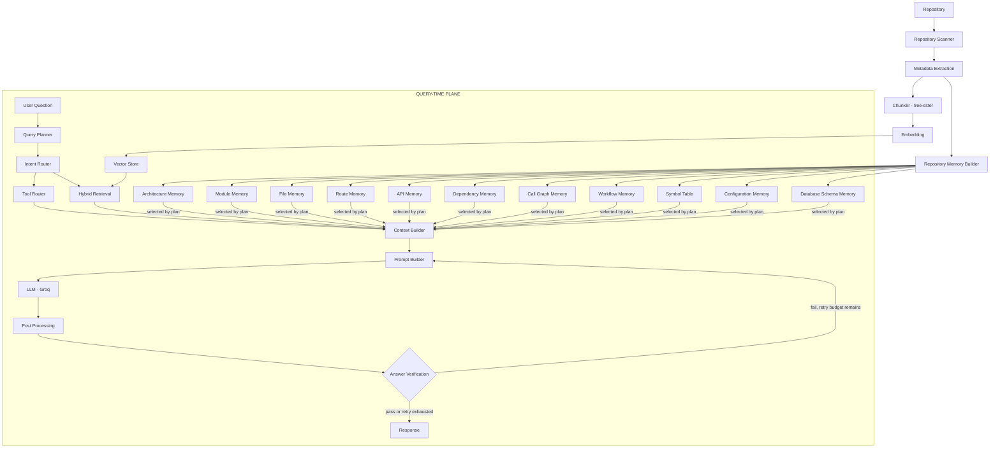

# SYSTEM_ARCHITECTURE.md

### CodeGraph — AI Copilot System Architecture

_Derived from COPILOT_REBUILD_PLAN.md. This document is the standing architecture reference: components, responsibilities, data contracts, and system boundaries. Roadmap, prompt-template wording, and future-feature discussion live in the rebuild plan, not here._

---

## 1. System Overview

CodeGraph is split into two clearly separated planes:

- **Index-Time Plane** — runs once per repository (and incrementally on file change). Produces the Vector Store and the eleven Repository Memory artifacts. Nothing here is query-specific.
- **Query-Time Plane** — runs once per user question. Consumes the index-time artifacts, classifies the question, plans an execution strategy, retrieves and assembles evidence, prompts the LLM, and verifies the output before returning it.

The governing architectural rule: **no component in the Query-Time Plane may hand the LLM an unspecified task.** Every query is reduced to a classified intent, a resolved entity set, a retrieval strategy, and an attributed evidence bundle before the Prompt Builder runs. All context injected into a prompt is selected for a reason traceable to the Query Planner's output — never injected by default.

---

## 2. High-Level Architecture Diagram

```
Repository
    ↓
Repository Scanner        (file roles, directory graph, manifest)
    ↓
Metadata Extraction       (symbol tables, exports/imports, per-file summaries)
    ↓
Chunker                   (tree-sitter, function/class boundaries, parent linkage)
    ↓
Embedding                 (code-aware model; chunk-level + summary-level)
    ↓
Vector Store
    ↓
Repository Memory Builder (11 artifacts — see §5)

════════════════════ QUERY-TIME PLANE (per question) ════════════════════

User Question
    ↓
Query Planner              (intent, entities, required tools/memories,
                             retrieval strategy, expected output structure)
    ↓
Intent Router               (selects pipeline per classified intent)
    ↓
Tool Router                 (invokes deterministic tools per plan)
    ↓
Hybrid Retrieval             (BM25 + vector, metadata-filtered,
                              parent-doc expansion, reranked)
    ↓
Context Builder             (attribute, order, dedupe, prioritize)
    ↓
Prompt Builder               (intent-specific template, citation mandate,
                              forbidden-wording constraint)
    ↓
LLM (Groq)
    ↓
Post Processing              (parse structured output, attach citations)
    ↓
Answer Verification          (intent match / citations / evidence /
                              hallucination check — bounded retry on fail)
    ↓
Response → Frontend Copilot
```



---

## 3. Index-Time Components

| Component                     | Responsibility                                                                                                                                        | Input                              | Output                             |
| ----------------------------- | ----------------------------------------------------------------------------------------------------------------------------------------------------- | ---------------------------------- | ---------------------------------- |
| **Repository Scanner**        | Walk the repo tree; classify each file by role (entrypoint, service, model, test, config, util); build the directory/file graph                       | Raw repository                     | File manifest with role tags       |
| **Metadata Extraction**       | Extract per-file exports/imports and a one-line summary; identify per-symbol metadata                                                                 | File manifest                      | File metadata records              |
| **Chunker (tree-sitter)**     | Split source into syntax-aware chunks at function/class boundaries; preserve parent (file/class) linkage                                              | Source files                       | Chunk records with parent pointers |
| **Embedding**                 | Generate vector representations at chunk level and at summary level, using a code-aware embedding model                                               | Chunks + summaries                 | Vectors                            |
| **Vector Store**              | Persist chunk vectors with filterable metadata (file, symbol, role, line range, chunk type)                                                           | Vectors + metadata                 | Queryable vector index             |
| **Repository Memory Builder** | Construct the 11 structured memory artifacts (§5) — deterministic ones via AST/tree-sitter extraction, interpretive ones via scoped LLM summarization | File metadata, chunks, symbol data | 11 independent memory stores       |

---

## 4. Query-Time Components

| Component               | Responsibility                                                                                                                                                                                | Input                                              | Output                                                                   |
| ----------------------- | --------------------------------------------------------------------------------------------------------------------------------------------------------------------------------------------- | -------------------------------------------------- | ------------------------------------------------------------------------ |
| **Query Planner**       | Convert the raw question + classified intent into a structured execution plan: entities, required modules/tools/memories, retrieval strategy, expected output structure                       | Raw query, intent, entities                        | Execution plan (see §6.3)                                                |
| **Intent Router**       | Classify the query into one of the fixed intents; select the routing path (pipeline, tool candidates, memory candidates)                                                                      | Raw query                                          | Intent + routing decision                                                |
| **Tool Router**         | Invoke the deterministic tools named in the execution plan; never invokes speculatively                                                                                                       | Execution plan                                     | Tool output records                                                      |
| **Hybrid Retrieval**    | BM25 + vector search, metadata-filtered, parent-document expansion, cross-encoder reranked                                                                                                    | Query/sub-queries, Vector Store                    | Ranked candidate chunks                                                  |
| **Context Builder**     | Normalize every chunk (from retrieval and from tools) into one attributed schema; dedupe by symbol identity; order (relevance or execution order per intent); prioritize under context budget | Retrieved chunks, tool output, selected memories   | Ordered, attributed context payload                                      |
| **Prompt Builder**      | Select the intent-specific system/developer prompt template; inject the attributed context; attach citation mandate and forbidden-generic-wording constraint                                  | Execution plan, context payload                    | Final LLM prompt                                                         |
| **LLM (Groq)**          | Generate the answer against the fully-specified prompt                                                                                                                                        | Prompt                                             | Raw model output                                                         |
| **Post Processing**     | Parse structured output; attach/link citations to the chunks that back them                                                                                                                   | Raw model output                                   | Structured answer + citation map                                         |
| **Answer Verification** | Check: intent match, citation presence, evidence-per-claim, no hallucinated citations; trigger bounded retry (cap 1) with corrective addendum on failure                                      | Structured answer, execution plan, context payload | Verified answer, or low-confidence-flagged answer after retry exhaustion |
| **Conversation Memory** | Persist resolved entities/intent across turns for pronoun/reference resolution                                                                                                                | Turn history                                       | Resolved entity context for next turn's Query Planner                    |
| **Confidence Scoring**  | Score reliability from retrieval strength + verification outcome                                                                                                                              | Verification result, retrieval scores              | Confidence value surfaced to frontend                                    |

---

## 5. Repository Memory Architecture

Each memory is an independently built, independently queryable store — never concatenated into a single document injected by default.

| Memory                 | Source                                               | Build Method                                                     | Deterministic?    |
| ---------------------- | ---------------------------------------------------- | ---------------------------------------------------------------- | ----------------- |
| Architecture Memory    | Module memories, directory/import structure          | Bottom-up LLM summarization, validated against actual structure  | No (interpretive) |
| Module Memory          | Per-module file set                                  | LLM summary from constituent file summaries                      | No (interpretive) |
| File Memory            | Per-file content                                     | One-line LLM summary per file                                    | No (interpretive) |
| Route Memory           | Router/framework registration code                   | AST pattern match on route-registration calls                    | Yes               |
| API Memory             | External API client call sites                       | AST match against known SDK/client call patterns                 | Yes               |
| Dependency Memory      | Import/export statements                             | AST-based import graph                                           | Yes               |
| Call Graph Memory      | Function/method call expressions                     | Tree-sitter call resolution, cross-file via Symbol Table         | Yes               |
| Workflow Memory        | Route Memory + Call Graph traversal from entrypoints | Precomputed traversal, cached                                    | Yes               |
| Symbol Table           | Every function/class/const definition                | Tree-sitter extraction: name, file, lines, kind, signature       | Yes               |
| Configuration Memory   | Config files + code read-sites                       | AST/pattern match: config keys → definitions → consumption sites | Yes               |
| Database Schema Memory | Migration files, ORM model definitions               | Parse model classes / migration DDL into schema structure        | Yes               |

**Design rule:** deterministic memories (8 of 11) are built via static extraction, not LLM generation — this removes hallucination risk at the memory layer and allows cheap incremental recomputation on file change. LLM generation is reserved for the three memories that are inherently interpretive (Architecture, Module, File).

---

## 6. Data Contracts

### 6.1 Chunk Record (produced at index time, stored in Vector Store)

```
{
  chunk_id: string,
  file: string,
  symbol: string | null,        // function/class name, or null for module-level
  symbol_kind: "function" | "class" | "method" | "module" | null,
  module: string,
  lines: [start: int, end: int],
  role: "entrypoint" | "service" | "model" | "test" | "config" | "util",
  parent_chunk_id: string | null,  // for parent-document retrieval
  vector: float[],
  text: string
}
```

### 6.2 Context Builder Output (per chunk, normalized regardless of source)

```
{
  file: string,
  function: string | null,
  class: string | null,
  module: string,
  lines: [int, int],
  reason_selected: string,          // why this chunk was chosen
  code: string,
  relationship_to_question: string  // how this chunk answers the query
}
```

### 6.3 Query Planner Execution Plan

```
{
  intent: string,                    // one of the fixed intent set
  secondary_intents: string[],       // for multi-intent queries
  entities: [{ name: string, type: "symbol" | "file" | "api" | "module" | "concept" | "config_key" }],
  required_modules: string[],
  required_tools: string[],
  required_memories: string[],
  retrieval_strategy: "symbol_table_lookup" | "hybrid_semantic" | "graph_traversal" | "schema_lookup",
  entrypoint_hint: string | null,
  expected_output_structure: string  // e.g. "numbered_step_trace", "direct_match_list"
}
```

### 6.4 Verification Result

```
{
  intent_match: boolean,
  has_citations: boolean,
  evidence_coverage: float,          // proportion of factual claims with a citation
  hallucinated_citations: string[],  // citations not present in the context payload sent
  passed: boolean,
  retry_count: int
}
```

---

## 7. Intent Set and Routing Table

Fixed intent taxonomy: `architecture`, `workflow_tracing`, `security_review`, `bug_finding`, `code_explanation`, `refactoring`, `api_tracing`, `dependency_tracing`, `file_lookup`, `database_query`, `configuration`, `performance_analysis`, `testing`.

| Intent               | Retrieval Strategy                           | Tools                                         | Memories                    |
| -------------------- | -------------------------------------------- | --------------------------------------------- | --------------------------- |
| architecture         | Module-summary retrieval                     | Architecture Analyzer                         | Architecture, Module        |
| workflow_tracing     | Graph traversal + semantic, layer-decomposed | Workflow Tracer, Route Finder, Graph Explorer | Workflow, Route, Call Graph |
| security_review      | Semantic + pattern match                     | Security Analyzer                             | Dependency                  |
| bug_finding          | Symbol/file-targeted + semantic              | Bug Detector                                  | Module                      |
| code_explanation     | Direct symbol/file retrieval                 | Symbol Lookup                                 | —                           |
| refactoring          | Symbol-targeted + semantic                   | Complexity Analyzer, Dead Code Finder         | Module                      |
| api_tracing          | Symbol table + call graph                    | API Finder, Graph Explorer                    | API, Call Graph             |
| dependency_tracing   | Dependency graph query                       | Dependency Explorer                           | Dependency                  |
| file_lookup          | Symbol table first, semantic fallback        | Symbol Lookup                                 | Symbol Table                |
| database_query       | Schema lookup + code retrieval               | Route Finder                                  | Database Schema             |
| configuration        | Config memory + usage-site retrieval         | Symbol Lookup                                 | Configuration               |
| performance_analysis | Symbol-targeted + semantic                   | Complexity Analyzer, Graph Explorer           | Call Graph                  |
| testing              | File-pattern retrieval + target code         | Symbol Lookup                                 | Module                      |

Fallback: below-confidence classification routes to a structured General Explanation path (hybrid retrieval + Code Explanation contract) — never to an unstructured generic prompt.

---

## 8. Tool Architecture

| Tool                  | Reads From                                      | Deterministic |
| --------------------- | ----------------------------------------------- | ------------- |
| Symbol Lookup         | Symbol Table                                    | Yes           |
| Bug Detector          | Static linters + AST antipattern rules          | Yes           |
| Security Analyzer     | Security ruleset over target code               | Yes           |
| Dead Code Finder      | Symbol Table ∩ Call Graph (unreferenced defs)   | Yes           |
| Route Finder          | Route Memory                                    | Yes           |
| API Finder            | API Memory                                      | Yes           |
| Dependency Explorer   | Dependency Memory                               | Yes           |
| Graph Explorer        | Call Graph Memory                               | Yes           |
| Complexity Analyzer   | Static complexity computation over target scope | Yes           |
| Git History Analyzer  | `.git` metadata                                 | Yes           |
| Workflow Tracer       | Route Memory + Graph Explorer (composed)        | Yes           |
| Architecture Analyzer | Module Memory + Dependency Memory (aggregated)  | Yes           |

All tools are deterministic, non-generative functions. The LLM's role with respect to tool output is to narrate and format findings inside the intent-specific template — never to regenerate or re-derive them.

---

## 9. Retrieval Architecture

- **Hybrid Search:** BM25 and vector search run in parallel; candidate sets are merged before reranking.
- **Metadata Filtering:** candidates filtered by role/module tags when intent implies a target layer (e.g., service-role files for API questions).
- **Parent Document Retrieval:** match at chunk granularity, return the parent function/file for completeness.
- **Cross-Encoder Reranking:** applied to the merged hybrid candidate set.
- **Graph Retrieval:** intent-gated — invoked via Tool Router only for `workflow_tracing`, `api_tracing`, `dependency_tracing`, not run by default.
- **Chunk Ranking:** relevance-descending by default; overridden to execution order (from Graph Explorer) for `workflow_tracing` and `api_tracing`.
- **Deduplication:** by `(file, lines)` overlap, before Context Builder assembly.
- **Context Compression:** not implemented — deferred unless attributed/deduplicated context is empirically shown to exceed the model's usable window.

---

## 10. Verification and Reliability Architecture

Answer Verification runs four checks against every Post Processing output before it is returned:

1. Structural match between actual output and the Query Planner's `expected_output_structure`.
2. Presence of file/line citations, required for all intents except pure architecture overviews.
3. Evidence coverage — factual claims must be citation-adjacent above a threshold proportion.
4. Citation validity — every cited file:line must exist in the context payload actually sent to the LLM; citations not traceable to the sent context are flagged as hallucinated.

On failure: one bounded retry with a corrective developer-prompt addendum naming the specific failure. If the retry also fails, the answer is returned with a visible low-confidence flag rather than silently delivered or infinitely retried.

---

## 11. System Boundaries

- **In scope:** question-answering and code analysis grounded in the indexed repository's actual structure and content.
- **Out of scope (by design):** autonomous multi-step code modification/execution (agentic write-access), speculative pre-fetching, and any component that would let the LLM answer without a classified intent and an attributed evidence bundle. These boundaries are architectural, not incidental — the system has no code path that reaches the LLM with an unspecified task.

---

_End of SYSTEM_ARCHITECTURE.md._
